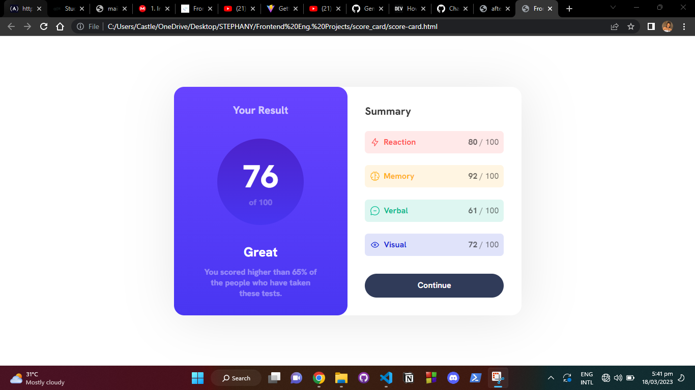

# Responsive Score Card

This is a solution to the score card challenge on the [Frontend Mentor Website](https://www.frontendmentor.io) to practice using vanilla CSS to build.

## Table of Contents

- [Overview](#overview)
    - [The Challenge](#the-challenge)
    - [Screenshot](#screenshot)
- [My Process](#my-process)
    - [Technology Used](#technology-used)
    - [Lesson Learned](#lesson-learned)
- [Author](#author)

## Overview

### The Challenge

Users should be able to:

- Fill in the form and see the card details update in real-time
- Receive error messages when the form is submitted if:
  - Any input field is empty
  - The card number, expiry date, or CVC fields are in the wrong format
- View the optimal layout depending on their device's screen size
- See hover, active, and focus states for interactive elements on the page

### Screenshot

## My Process

### Technology Used

- Semantic HTML5 Markup
- CSS custom properties???
- CSS Flexbox
- Mobile-first workflow

### Lesson Learned

I learned in-depth what SVGs are and that they maintain quality regardless of how much their size is altered as they're made with code. I learned the application of gradient in CSS. I learned to write maintainable code using variables for colors in CSS, I also learned about targeting direct and indirect descendants of an element without the use of an extra class/id and I learned how specificity works and calculation specificity factor.

## Author

- Website - [Stephany Ikebudu](https://www.stephikebudu.dev)
- Frontend Mentor - [@stephikebudu](https://www.frontendmentor.io/profile/stephikebudu)
- Twitter - [@stephikebudu](https://www.twitter.com/stephikebudu)
